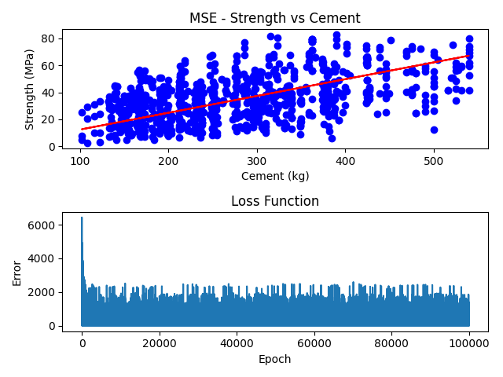

# gradient-descent-algorithm

Implementation of Linear Regression Models based on the Gradient Descent Algorithm.

## Requirements

-   Python 3.10+
-   Python Libraries
    -   pandas
    -   numpy
    -   matplotlib
    -   sklearn

Use the following command to automatically install all dependencies:
'''
pip install requirements.txt
'''

# How to run

Simply clone this repository and run the following commands:

-   For the uni-variable implementation:
    ```
    python univariable.py
    ```
-   For the multi-variable implementation:
    ```
    python multivariable.py
    ```

# Expected Input

There are two variables that are used to control the scripts: `PROCESSING_TYPE` and `ALGO`

-   `PROCESSING_TYPE` can be either `"SCALED"` or `"NORMAL"`.

-   `ALGO` can be either `"MSE"` or `"MAE"`.

### Example

If you want to use the objective function of Mean Squared Error (MSE) and pre-process the training data, then set:

```
ALGO = "MSE"
PROCESSING_TYPE = "SCALED"
```

# Expected Output

Running each script will generate image output in the `./imgs/` directory.

For the uni-variable script the images will contain two graphs: Linear fit and plot of the cost function. The multi-variable script will only include a graph of the cost function. In addition, both scripts will print to the terminal the Variance Explained for each feature for both training and testing scenarios.

## Sample Terminal Output (Uni-variable):

```
Cement
        Train Variance Explained= 0.2474520281413406
        Test Variance Explained= -6.426991743646967

BlastFurnaceSlag
        Train Variance Explained= 0.022963335238228688
        Test Variance Explained= -0.5452863072316203

FlyAsh
        Train Variance Explained= 0.01629579685651139
        Test Variance Explained= -0.16739304241051323

Water
        Train Variance Explained= 0.09252248481706282
        Test Variance Explained= -0.06411742955040522

Superplasticizer
        Train Variance Explained= 0.1421888737897652
        Test Variance Explained= 0.06751196830222583

CoarseAgg
        Train Variance Explained= -0.008409395209443726
        Test Variance Explained= -0.05332247068357021

FineAgg
        Train Variance Explained= 0.024493920177585227
        Test Variance Explained= -0.23268549504955405

Age
        Train Variance Explained= 0.10184245921632529
        Test Variance Explained= -1.079601429242926
```

## Sample Image Output (Uni-variable):



## Sample Terminal Output (Multi-variable):

```
Train Variance Explained= 0.5404750110506564
Test Variance Explained= -4.65288710074262
```

## Sample Image Output (Multi-variable):


